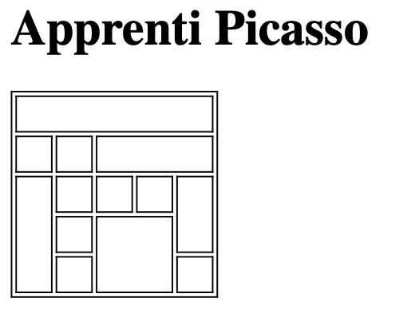

# `<table>` 

## Objectifs:

1. Pratiquer les balises `<table>`, `<tr>`, `<td>` et `<th>`

## Consigne

1. Ajouter la balise style à votre `<head>`

	
	```html
	<style type="text/css">
	      table, th, td {
	        border: 1px solid black;
	        min-width: 20px;
	        height: 20px;
	      }
	</style>
	```

2. Reproduisez la table suivante



